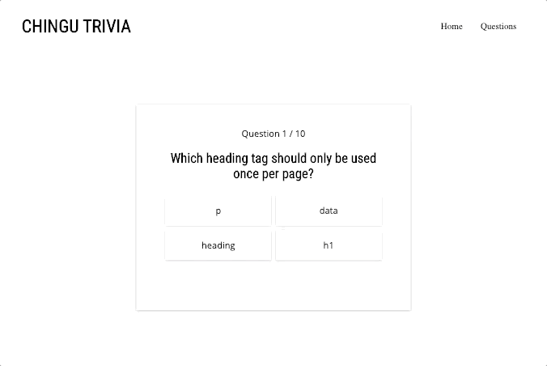

# Chingu Solo Project - Tier 3 - Chingu Trivia

## Overview 

This project is a great opportunity to develop a clean and modern webpage. The trivia app will be completed across tiers, with each tier adding a new level of complexity. You are currently on the **Tier 3 repo**. You'll be responsible for coding the **HTML**, **CSS**, and **JavaScript** to get the structure, styling, and functionality up and running.

As you add skills to your developer toolbag you'll be able to come back to this project and add in even more features. Ultimately you'll have a great portfolio piece, and will have implemented a number of common and in-demand features.

**You May Use Libraries and/or Frameworks**

## Instructions

General instructions for all Pre-Work Projects can also be found in the Chingu Voyage Handbook (URL posted in the `#read-me-first` channel on Discord).

#### Requirements

*Structure*

- [ ] Header item that includes the name for the app, and tabs (if using)
- [ ] Card that displays a trivia question with multiple choice AND true/false questions
- [ ] Place element that displays which question number the user is on and the total number of questions (ex. 'Question 1 / 10')
- [ ] Display buttons for advancing to the next question once the current question has been answered
- [ ] Display a message to the user that informs them if their answer was right or wrong
- [ ] Display a clear message to the user when the trivia session is done, and include the user's score

*Styling:*

- [ ] Styles should be reminiscent of the demo versions. Feel free to use artistic licencse as long as the functionality doesn't suffer 

*Functionality*

- [ ] The quiz should span all questions in the question api (see below for api information)
- [ ] The page should not reload!
- [ ] Questions are received from the api at the following address: *https://johnmeade-webdev.github.io/chingu_quiz_api/trial.json*
- [ ] The api is static and does not take in parameters or require a key, simply make your fetch to the above address
- [ ] Include a way to sort questions by subject so that a user can answer questions specific to the subject of their choosing, *look through the api response to see how you can do this*
- [ ] Track a user through sessions using some kind of backend persistence; this should allow the user to never have any repeat questions unless they clear their progress

*Upon Load:*

- [ ] Load the first question and display the user's place as *Question 1 / 10*
- [ ] Make sure the button used to advance questions is either not visible or not clickable until an answer is submitted

*Considerations:*

- [ ] Try and style your app so that it doesn't overflow the viewport (require scrolling) on any device
- [ ] Make sure your User Experience design is intuitive (buttons are clearly disabled when not available, messages are clear, etc)
- [ ] In the name of responsiveness: please try and have your answer buttons (or divs, or whatever you use) collapse into a column in small sizes (iPhone5, etc)

*Other:*

- [ ] Your repo needs to have a robust README.md
- [ ] Make sure that there are no errors in the developer console before submitting

**Extras (Not Required)**

- [ ] Make your design fully responsive *(small/large/portrait/landscape, etc.)*
- [ ] Offer the user the ability to navigate to previous questions
- [ ] Play with formats for user interaction: drag 'n drop vs. click, etc.
- [ ] ** *Special Assignment* **: Add to the api! Fork the repo and add your own questions following the same design patterns in the api, then submit a Pull Request!

## Example

